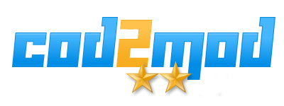

<p align="center"></p>

<p align="center">
<a href="https://www.paypal.com/cgi-bin/webscr?cmd=_s-xclick&hosted_button_id=2CA99TABVKCG6&source=url"></a>
</p>
<br />

> COD2MOD (Call of Duty 2 Mod) is the [Multi Theft Auto](https://mtasa.com) shooter gamemode released in July 2010. It was made by Mateusz "bmat" Brakoniecki.

<br />

## Getting started
1. Copy all the files to your server resources directory.
2. If your server is running, use "refresh" command in your server console.
3. Run the gamemode:
```
start cod2mod
```
4. TODO: ACL privileges for gamemode
<br /><br />

## Licensing


This software is licensed under Creative Commons BY-NC-ND license. It's free to use with some restrictions:
* BY (Attribution) - you must give credit to original authors and inform about license.
* NC (NonCommercial) - you cannot use this software for commercial purposes.
* ND (NoDerivatives) - you cannot make and distribute the modified version of this software.

For more information please read the full text of [Creative Commons License](https://creativecommons.org/licenses/by-nc-nd/4.0/).
<br /><br />

## Backers
Support us with a donation to help us continue the development.<br />

<a href="https://www.paypal.com/cgi-bin/webscr?cmd=_s-xclick&hosted_button_id=2CA99TABVKCG6&source=url"></a>
<br /><br />

## Contributing
We don't have specified contributing policy at the moment.